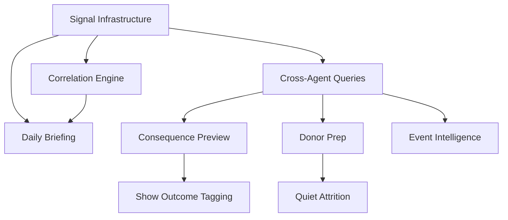

# Voxcast: Epic & Story Breakdown

**Version:** 1.0
**Date:** January 8, 2026
**Status:** Ready for Sprint Planning

---

## Overview

This document breaks down the features identified in the brainstorming session into implementable epics and user stories, organized by priority tier.

### Priority Framework

| Priority | Description | Target Release |
|----------|-------------|----------------|
| **P0** | Architectural foundation — Must be built first | Q2 2025 |
| **P1** | Universal high-value features | Q3 2025 |
| **P2** | Role-specific tools with clear ROI | Q3-Q4 2025 |
| **P3** | Future innovations requiring research | Q4 2025+ |

---

## P0: Station Pulse Architecture

> **Epic Theme:** Build the cross-agent intelligence layer that enables all other Station Pulse features.

### Epic 1: Signal Infrastructure

**Description:** Create the foundational system for agents to emit and store signals.

#### Stories

| ID | Story | Points | Acceptance Criteria |
|----|-------|--------|---------------------|
| SP-101 | **Signal Data Model** As a developer, I need a Convex schema for signals so agents can emit structured events | 3 | - `signals` table with all fields per architecture doc - Indexes for station, type, category, severity, active status - TypeScript types exported |
| SP-102 | **Signal Emission API** As an agent, I can emit signals so Station Pulse can track events | 5 | - `emitSignal` mutation accepts signal params - Validates signal type against taxonomy - Auto-calculates delta and direction - Respects expiration settings |
| SP-103 | **Signal Taxonomy Definition** As a product owner, I need a complete signal taxonomy so we know what to track | 3 | - All signal types defined for 4 agents + system - Severity rules for each signal type - Documentation of when each fires |
| SP-104 | **Sarah Signal Integration** As Sarah (Development), I emit signals when I detect donor patterns | 5 | - `donor_engagement` signal on contact gaps - `donor_attrition_risk` on declining engagement - `campaign_performance` on milestone checks - Integrated with existing tools |
| SP-105 | **Diana Signal Integration** As Diana (Underwriting), I emit signals when I detect sponsor patterns | 5 | - `sponsor_engagement` on contact gaps - `renewal_risk` on concerning patterns - `pipeline_health` on pipeline analysis - Integrated with existing tools |
| SP-106 | **Jordan Signal Integration** As Jordan (Programming), I emit signals on content decisions | 5 | - `schedule_change_proposed` before changes - `ratings_change` on significant shifts - `partnership_opportunity` on new discussions - Integrated with existing tools |
| SP-107 | **Marcus Signal Integration** As Marcus (Marketing), I emit signals on audience patterns | 5 | - `audience_growth` on metric changes - `campaign_performance` on results - `channel_efficiency` on ROI analysis - Integrated with existing tools |

**Total Points: 31**

---

### Epic 2: Correlation Engine

**Description:** Build the system that detects patterns across signals from multiple agents.

#### Stories

| ID | Story | Points | Acceptance Criteria |
|----|-------|--------|---------------------|
| SP-201 | **Correlation Data Model** As a developer, I need a schema for correlations so detected patterns can be stored | 3 | - `correlations` table with all fields - Indexes for station, type, status - Links to related signals |
| SP-202 | **Programming ↔ Development Collision Rule** As a GM, I'm alerted when schedule changes affect donors | 8 | - Triggers on `schedule_change_proposed` - Queries donor-show preferences - Creates correlation if major donors affected - Sets appropriate severity |
| SP-203 | **Marketing ↔ Underwriting Collision Rule** As a GM, I'm alerted when campaigns may conflict with sponsors | 5 | - Triggers on campaign signals - Checks sponsor competitive categories - Creates correlation on conflicts |
| SP-204 | **Events ↔ ROI Collision Rule** As a GM, I'm alerted when events have poor ROI | 5 | - Triggers on `event_completed` - Calculates ROI metrics - Flags negative ROI events |
| SP-205 | **Content ↔ Membership Collision Rule** As a GM, I'm alerted when content decisions affect sustainers | 5 | - Triggers on schedule changes - Correlates with member listening data - Creates collision if high overlap |
| SP-206 | **Grant ↔ Reality Collision Rule** As a GM, I'm alerted when decisions conflict with grant commitments | 5 | - Triggers on content decisions - Queries active grant commitments - Creates collision if show mentioned in grants |
| SP-207 | **Correlation Processing Pipeline** As Station Pulse, I process signals through all rules automatically | 8 | - Signal triggers rule evaluation - All applicable rules checked - Correlations stored atomically - Performance < 500ms per signal |

**Total Points: 39**

---

### Epic 3: Daily Briefing System

**Description:** Generate and deliver daily intelligence briefings to station leadership.

#### Stories

| ID | Story | Points | Acceptance Criteria |
|----|-------|--------|---------------------|
| SP-301 | **Briefing Data Model** As a developer, I need a schema for storing generated briefings | 2 | - `briefings` table created - All fields per architecture doc - Indexes for station and date |
| SP-302 | **Briefing Generation Logic** As Station Pulse, I generate prioritized briefings from signals and correlations | 8 | - Gathers 24hr active signals - Ranks by severity - Groups correlations - Creates priority items list |
| SP-303 | **Briefing Scheduler** As a station, my briefing is generated every morning at 6 AM local time | 3 | - Convex cron job configured - Respects station timezone - Handles multiple stations |
| SP-304 | **Cross-Department Activity Summary** As a GM, I see what each department worked on yesterday | 5 | - Summarizes recent conversations per agent - Shows active projects - Highlights upcoming items |
| SP-305 | **Briefing Dashboard UI** As a GM, I can view my daily briefing in the Voxcast dashboard | 8 | - Briefing page component - Priority items with expand/collapse - Signals to watch section - Cross-department activity grid |
| SP-306 | **Briefing Email Delivery** As a GM, I can receive my briefing via email | 5 | - Email template for briefing - Sendgrid/Resend integration - Delivery preference setting |

**Total Points: 31**

---

### Epic 4: Cross-Agent Queries

**Description:** Enable agents to query knowledge from other agent domains.

#### Stories

| ID | Story | Points | Acceptance Criteria |
|----|-------|--------|---------------------|
| SP-401 | **Cross-Agent Query API** As an agent, I can query information from other agent domains | 5 | - Query functions for each cross-domain lookup - Results formatted for agent consumption - Performance < 200ms |
| SP-402 | **Donor-Sponsor Connection Query** As Sarah, I can ask if a donor has sponsor connections | 3 | - Query by donor ID - Returns overlapping sponsors - Includes relationship type |
| SP-403 | **Show Impact Profile Query** As Jordan, I can get full impact profile for any show | 5 | - Query by show ID - Returns donor count/value - Returns sponsor count/value - Returns grant mentions |
| SP-404 | **Prospect-Donor Connection Query** As Diana, I can check if prospects connect to donors | 3 | - Query by company name - Returns employee donors - Includes giving totals |
| SP-405 | **Sustainer Content Preference Query** As Marcus, I can see what content sustainers prefer | 3 | - Aggregates sustainer preferences - Returns top 10 shows - Includes listen frequency |

**Total Points: 19**

---

## P0 Summary

| Epic | Points | Duration Estimate |
|------|--------|-------------------|
| Signal Infrastructure | 31 | 2 weeks |
| Correlation Engine | 39 | 2 weeks |
| Daily Briefing System | 31 | 1.5 weeks |
| Cross-Agent Queries | 19 | 1 week |
| **Total** | **120** | **6.5 weeks** |

---

## P1: Prep Briefs System

> **Epic Theme:** Role-specific one-pagers that prepare each user before meetings, events, and decisions.

### Epic 5: Donor Prep (Sarah)

**Description:** 60-second donor preparation briefs before any donor interaction.

#### Stories

| ID | Story | Points | Acceptance Criteria |
|----|-------|--------|---------------------|
| PB-101 | **Donor Prep Tool Definition** As Sarah, I have a `generate_donor_prep` tool in my toolkit | 3 | - Tool definition with input schema - Takes donor ID or name - Returns structured brief |
| PB-102 | **Relationship Snapshot Section** As a Development Director, I see the donor's relationship history | 5 | - Last 5 interactions with dates - Giving history summary - Current giving level |
| PB-103 | **What They Care About Section** As a Development Director, I see donor interests and preferences | 5 | - Favorite shows/content - Past event attendance - Stated interests from conversations |
| PB-104 | **Landmines Section** As a Development Director, I see potential sensitive topics | 5 | - Past issues or complaints - Known sensitivities - Relationship warnings |
| PB-105 | **The Opening Section** As a Development Director, I get a suggested conversation starter | 3 | - Recent relevant event to mention - Connection opportunity - Personalized greeting suggestion |
| PB-106 | **Ask Context Section** As a Development Director, I understand appropriate ask levels | 5 | - Suggested ask amount - Giving capacity indicators - Best timing considerations |
| PB-107 | **Donor Prep UI Component** As a user, I can view donor prep as a formatted card | 5 | - One-page card design - Print-friendly layout - Mobile-responsive |

**Total Points: 31**

---

### Epic 6: Call Prep (Diana)

**Description:** One-pager before any sponsor/prospect meeting.

#### Stories

| ID | Story | Points | Acceptance Criteria |
|----|-------|--------|---------------------|
| PB-201 | **Call Prep Tool Definition** As Diana, I have a `generate_call_prep` tool | 3 | - Tool definition with input schema - Takes sponsor/prospect ID - Returns structured brief |
| PB-202 | **Account Overview Section** As an Underwriting Director, I see account summary | 5 | - Current contract details - Spending history - Renewal timeline |
| PB-203 | **Recent Activity Section** As an Underwriting Director, I see recent interactions | 3 | - Last 5 touchpoints - Email/call summary - Any outstanding items |
| PB-204 | **Talking Points Section** As an Underwriting Director, I get meeting talking points | 5 | - Performance highlights to share - Value delivered since last contact - Listener feedback (if available) |
| PB-205 | **Objectives Section** As an Underwriting Director, I see meeting objectives | 3 | - Primary goal for meeting - Secondary goals - Next steps to propose |
| PB-206 | **Cross-Reference Section** As an Underwriting Director, I see donor/staff connections | 3 | - Any employee donors - Board connections - Community overlap |

**Total Points: 22**

---

### Epic 7: Event Intelligence Dashboard (Sarah)

**Description:** Pre-event analysis for fundraising events.

#### Stories

| ID | Story | Points | Acceptance Criteria |
|----|-------|--------|---------------------|
| PB-301 | **Event Intel Tool Definition** As Sarah, I have a `generate_event_intel` tool | 3 | - Takes event ID - Returns comprehensive intel |
| PB-302 | **Attendee Analysis** As a Development Director, I see attendee giving profiles | 8 | - All confirmed attendees - Giving history for each - Upgrade opportunities flagged |
| PB-303 | **Priority Guests List** As a Development Director, I know who needs attention | 5 | - Top 10 priority attendees - Reason for priority - Suggested approach |
| PB-304 | **Renewal Status Flags** As a Development Director, I see who needs renewal ask | 5 | - Attendees due for renewal - Lapsed members attending - Suggested renewal talk tracks |
| PB-305 | **Seating Strategy Suggestions** As a Development Director, I get seating recommendations | 5 | - Strategic table assignments - Prospect-donor pairing ideas - Board member placements |
| PB-306 | **Event Intel Dashboard UI** As a user, I can view event intel in a dashboard format | 8 | - Attendee grid with filters - Priority guest cards - Exportable PDF |

**Total Points: 34**

---

### Epic 8: Consequence Preview (Jordan)

**Description:** Impact forecast before any programming decision.

#### Stories

| ID | Story | Points | Acceptance Criteria |
|----|-------|--------|---------------------|
| PB-401 | **Consequence Preview Tool Definition** As Jordan, I have a `generate_consequence_preview` tool | 3 | - Takes show ID + proposed change - Returns impact analysis |
| PB-402 | **Show Profile Data Aggregation** As a Program Director, I see full show cross-department profile | 8 | - Audience metrics (ratings, streaming) - Donor connections (from Sarah) - Sponsor placements (from Diana) - Marketing campaigns featuring show |
| PB-403 | **Donor Impact Section** As a Program Director, I see how donors would be affected | 5 | - Count of donors who mention show - Total giving at risk - Major donors specifically |
| PB-404 | **Sponsor Impact Section** As a Program Director, I see sponsor implications | 5 | - Sponsors in affected daypart - Contract values at risk - Renewal timing context |
| PB-405 | **Grant Compliance Section** As a Program Director, I see grant implications | 5 | - Active grants mentioning show - Compliance risk level - Funder notification needs |
| PB-406 | **Risk Assessment Summary** As a Program Director, I get an overall risk score | 5 | - Green/Yellow/Red rating - Top 3 risks - Recommended mitigations |
| PB-407 | **Decision Confidence Signals** As a Program Director, I know if I can decide alone | 3 | - Green: Proceed with confidence - Yellow: Loop in stakeholders - Red: Cross-department review required |
| PB-408 | **Consequence Preview UI** As a user, I can view consequence preview in dashboard | 8 | - Show profile header - Impact sections with data viz - Risk assessment card - One-click "Flag for Review" |

**Total Points: 42**

---

## P1 Summary

| Epic | Points | Duration Estimate |
|------|--------|-------------------|
| Donor Prep (Sarah) | 31 | 1.5 weeks |
| Call Prep (Diana) | 22 | 1 week |
| Event Intelligence (Sarah) | 34 | 1.5 weeks |
| Consequence Preview (Jordan) | 42 | 2 weeks |
| **Total** | **129** | **6 weeks** |

---

## P2: Role-Specific Tools

> **Epic Theme:** High-value tools for individual roles that solve specific pain points.

### Epic 9: Quiet Attrition Detection (Sarah)

#### Stories

| ID | Story | Points | Acceptance Criteria |
|----|-------|--------|---------------------|
| QA-101 | **Attrition Detection Algorithm** Identify donors going cold before they lapse | 8 | - Tracks engagement velocity - Multiple signal inputs (opens, clicks, events) - Configurable thresholds |
| QA-102 | **Attrition Risk Dashboard** View at-risk donors with intervention suggestions | 5 | - Risk score visualization - Segmentation by risk level - One-click outreach triggers |
| QA-103 | **Re-engagement Campaign Templates** Pre-built templates for at-risk donor outreach | 5 | - Email templates - Call scripts - Event invite suggestions |

**Total Points: 18**

---

### Epic 10: Pipeline Intelligence (Diana)

#### Stories

| ID | Story | Points | Acceptance Criteria |
|----|-------|--------|---------------------|
| PI-101 | **Pipeline Scoring Algorithm** Prioritize opportunities based on multiple factors | 8 | - Scores probability to close - Factors in engagement recency - Considers deal size |
| PI-102 | **Pipeline Dashboard** View prioritized pipeline with health indicators | 5 | - Ranked opportunity list - Stage movement tracking - Stale deal alerts |
| PI-103 | **Pipeline Insights** AI-generated insights about pipeline health | 5 | - Weekly pipeline analysis - Bottleneck identification - Forecast confidence |

**Total Points: 18**

---

### Epic 11: Proposal Generator (Diana)

#### Stories

| ID | Story | Points | Acceptance Criteria |
|----|-------|--------|---------------------|
| PG-101 | **Proposal Template Library** Maintain templates for common proposal types | 5 | - Multiple package templates - Customizable sections - Brand guidelines applied |
| PG-102 | **Auto-Population from History** Pre-fill proposals with sponsor-specific data | 8 | - Past spending data - Previous packages - Personalized pricing |
| PG-103 | **80% Complete Proposal Output** Generate near-complete proposals | 8 | - Structured proposal document - Only key details need review - Export to PDF/DOCX |

**Total Points: 21**

---

### Epic 12: Renewal Briefs (Diana)

#### Stories

| ID | Story | Points | Acceptance Criteria |
|----|-------|--------|---------------------|
| RB-101 | **Renewal Brief Generation** Auto-generate renewal talking points | 5 | - Contract performance summary - Value delivered metrics - Renewal recommendation |
| RB-102 | **Renewal Timeline Tracking** Track all renewals with countdown | 3 | - Days to expiration - Status tracking - Alert thresholds |

**Total Points: 8**

---

### Epic 13: Audience Reality Map (Marcus)

#### Stories

| ID | Story | Points | Acceptance Criteria |
|----|-------|--------|---------------------|
| AR-101 | **Audience Profile Aggregation** Aggregate actual audience data across sources | 8 | - Nielsen/streaming data - Digital analytics - Survey data |
| AR-102 | **Audience vs. Assumption Comparison** Compare real audience to target personas | 5 | - Side-by-side visualization - Gap analysis - Recommendations |
| AR-103 | **Adjacent Audience Opportunities** Identify potential audience expansion | 5 | - Similar audience segments - Content gap analysis - Growth potential scoring |

**Total Points: 18**

---

### Epic 14: Journey Intelligence (Marcus)

#### Stories

| ID | Story | Points | Acceptance Criteria |
|----|-------|--------|---------------------|
| JI-101 | **Journey Stage Tracking** Track users through conversion funnel | 8 | - Unaware → Aware → Engaged → Member - Stage movement tracking - Time-in-stage analysis |
| JI-102 | **Conversion Path Analysis** Identify common conversion paths | 5 | - Top converting paths - Content attribution - Channel attribution |
| JI-103 | **Journey Optimization Recommendations** AI suggestions for improving conversion | 5 | - Bottleneck identification - A/B test suggestions - Content recommendations |

**Total Points: 18**

---

### Epic 15: Partnership Pipeline (Jordan)

#### Stories

| ID | Story | Points | Acceptance Criteria |
|----|-------|--------|---------------------|
| PP-101 | **Partnership Tracking System** Track external partnership opportunities | 5 | - Opportunity stages - Partner profiles - Contact history |
| PP-102 | **Partnership Value Assessment** Evaluate partnership opportunities | 5 | - Audience overlap analysis - Revenue potential - Brand alignment score |
| PP-103 | **Cross-Department Impact Check** Assess partnership impact on other departments | 5 | - Development conflicts - Underwriting conflicts - Resource requirements |
| PP-104 | **Collaboration Calendar** Track partnership timelines and dependencies | 3 | - Timeline visualization - Dependency tracking - Conflict detection |

**Total Points: 18**

---

## P2 Summary

| Epic | Points | Duration Estimate |
|------|--------|-------------------|
| Quiet Attrition Detection | 18 | 1 week |
| Pipeline Intelligence | 18 | 1 week |
| Proposal Generator | 21 | 1 week |
| Renewal Briefs | 8 | 0.5 weeks |
| Audience Reality Map | 18 | 1 week |
| Journey Intelligence | 18 | 1 week |
| Partnership Pipeline | 18 | 1 week |
| **Total** | **119** | **6.5 weeks** |

---

## P3: Future Innovations

> **Epic Theme:** Ambitious features requiring research and infrastructure investment.

### Epic 16: Living Narrative Library (Sarah)

**Description:** Single source of truth for station narrative, with audience-specific expressions.

#### Stories

| ID | Story | Points | Acceptance Criteria |
|----|-------|--------|---------------------|
| LN-101 | **Core Narrative Repository** | 8 | - Central narrative storage - Version history - Approval workflow |
| LN-102 | **Audience Expression Generator** | 8 | - Board-focused version - Donor-focused version - Grant-focused version |
| LN-103 | **Narrative Consistency Checker** | 5 | - Flag inconsistencies - Suggest alignments - Track usage |

**Total Points: 21**

---

### Epic 17: Channel Efficiency Analysis (Marcus)

#### Stories

| ID | Story | Points | Acceptance Criteria |
|----|-------|--------|---------------------|
| CE-101 | **Multi-Channel ROI Tracking** | 8 | - Cost per channel - Attribution modeling - Efficiency scoring |
| CE-102 | **Sunset Recommendations** | 5 | - Underperforming channels - Reallocation suggestions - Trend analysis |
| CE-103 | **Double-Down Recommendations** | 5 | - High-performing channels - Investment opportunities - Growth projections |

**Total Points: 18**

---

### Epic 18: Show Outcome Tagging (Jordan)

#### Stories

| ID | Story | Points | Acceptance Criteria |
|----|-------|--------|---------------------|
| SO-101 | **Outcome Classification System** | 8 | - Reach plays - Conversion plays - Brand plays - Revenue plays |
| SO-102 | **Outcome-Based Scheduling** | 8 | - Schedule optimization by outcome - Balance recommendations - Portfolio view |
| SO-103 | **Outcome Tracking Dashboard** | 5 | - Outcome distribution - Performance by outcome - Trend analysis |

**Total Points: 21**

---

## P3 Summary

| Epic | Points | Duration Estimate |
|------|--------|-------------------|
| Living Narrative Library | 21 | 1.5 weeks |
| Channel Efficiency Analysis | 18 | 1 week |
| Show Outcome Tagging | 21 | 1.5 weeks |
| **Total** | **60** | **4 weeks** |

---

## Grand Summary

| Priority | Epics | Total Points | Duration |
|----------|-------|--------------|----------|
| **P0** | 4 epics | 120 points | 6.5 weeks |
| **P1** | 4 epics | 129 points | 6 weeks |
| **P2** | 7 epics | 119 points | 6.5 weeks |
| **P3** | 3 epics | 60 points | 4 weeks |
| **Total** | **18 epics** | **428 points** | **23 weeks** |

---

## Recommended Sprint Plan

### Quarter 2: P0 Focus

| Sprint | Epics | Points |
|--------|-------|--------|
| Sprint 1-2 | Signal Infrastructure | 31 |
| Sprint 3-4 | Correlation Engine | 39 |
| Sprint 5-6 | Daily Briefing System + Cross-Agent Queries | 50 |

### Quarter 3: P1 Focus

| Sprint | Epics | Points |
|--------|-------|--------|
| Sprint 7-8 | Donor Prep + Call Prep | 53 |
| Sprint 9-10 | Event Intelligence + Consequence Preview (Start) | 42 |
| Sprint 11-12 | Consequence Preview (Complete) + P2 Start | 34 |

### Quarter 4: P2 + P3

| Sprint | Epics | Points |
|--------|-------|--------|
| Sprint 13-14 | Quiet Attrition + Pipeline Intel + Proposal Gen | 57 |
| Sprint 15-16 | Remaining P2 | 62 |
| Sprint 17-18 | P3 Features | 60 |

---

## Dependencies

### Critical Path

1. **Signal Infrastructure** (P0) — Foundation for everything
2. **Correlation Engine** (P0) — Enables collision detection
3. **Cross-Agent Queries** (P0) — Required for all prep briefs
4. **Consequence Preview** (P1) — Highest-value P1 feature
5. **Event Intelligence** (P1) — Second-highest P1 value

---

## Risks & Mitigations

| Risk | Impact | Mitigation |
|------|--------|------------|
| Signal taxonomy incomplete | High | Start with core signals, iterate based on usage |
| Correlation false positives | Medium | Add confidence scoring, allow user feedback |
| Data quality issues | High | Validate data on import, flag missing data |
| Performance at scale | Medium | Index optimization, caching strategies |
| User adoption | High | Start with GM-focused briefing, prove value early |

---

## Success Metrics by Priority

### P0 Success
- Daily briefings generated for 100% of active stations
- < 5% false positive rate on collision detection
- Briefing open rate > 60%

### P1 Success
- Prep briefs used in 80% of documented interactions
- Consequence Preview consulted before 90% of schedule changes
- Event ROI improvement of 20%

### P2 Success
- Attrition detection saves 10% of at-risk donors
- Pipeline velocity improvement of 15%
- Proposal generation time reduced by 70%

### P3 Success
- Narrative consistency score > 90%
- Channel efficiency improvement of 25%
- Outcome-based programming decisions > 50%

---

**Document Control**

| Version | Date | Author | Changes |
|---------|------|--------|---------|
| 1.0 | Jan 8, 2026 | Tarik Moody | Initial breakdown from brainstorming session |

---

*Ready for sprint planning and team allocation.*
